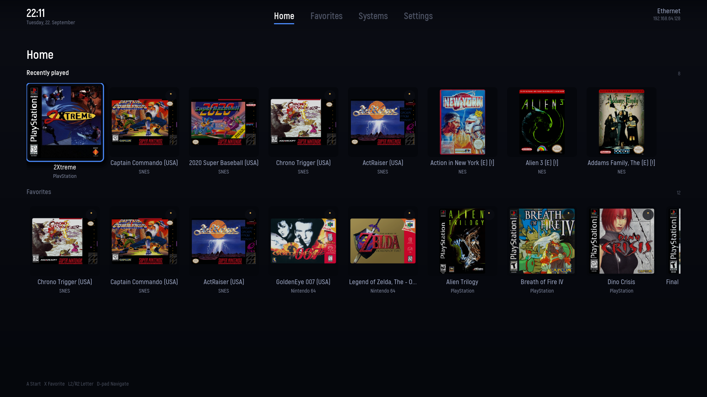
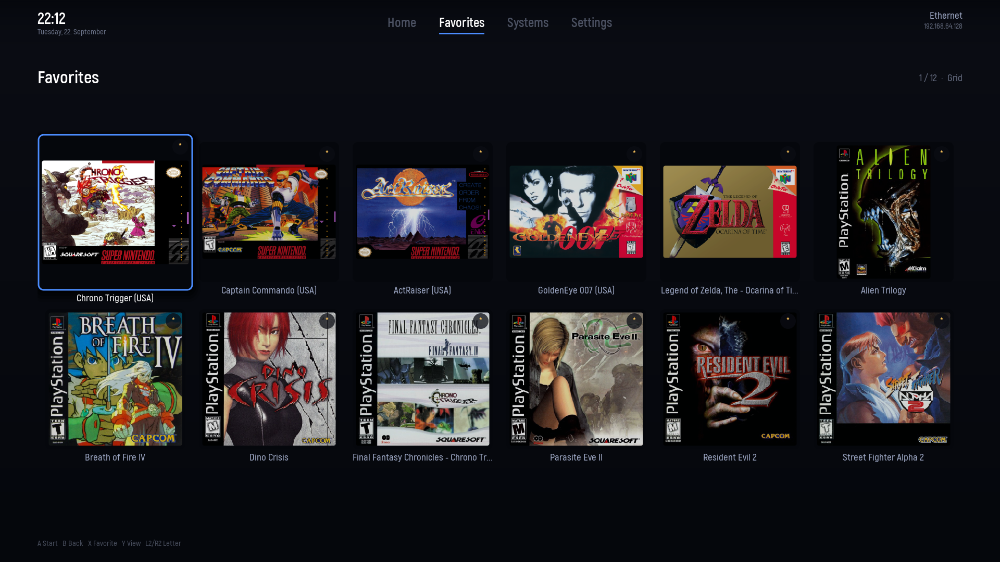
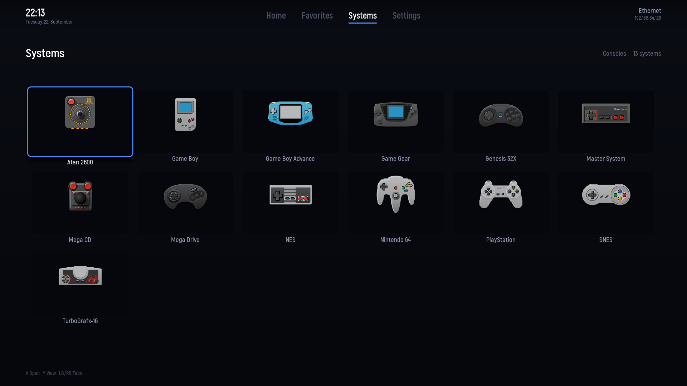
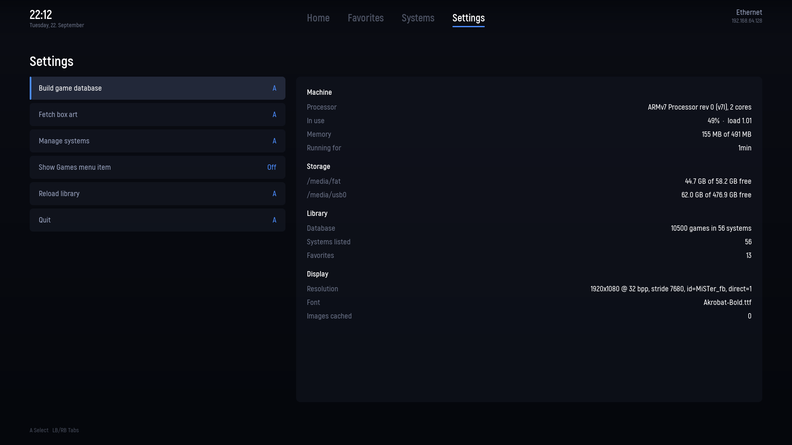

# MiSTer Pat's GUI

A modern game launcher for the [MiSTer FPGA](https://github.com/MiSTer-devel/Main_MiSTer),
written in plain C++ for the device's own Linux side. It boots straight into a 1080p tiled
interface with box art, favourites and history — and hands control back to the MiSTer as soon
as you start a game.

It is not a core. Nothing about the FPGA changes. This is a frontend that picks a game and
asks the MiSTer to load it, the same way the stock menu does.

| Home | Favorites |
| --- | --- |
|  |  |

| Systems | Settings |
| --- | --- |
|  |  |

## A note on how this was built

This project was built with the help of AI.

I want to be honest about that: without it, this project would not have grown from a proof
of concept into something that actually works — a project genuinely capable of replacing the
official Console Mode. Between the lack of documentation and the fact that Console Mode's own
source is no longer publicly available, reaching this point without that help would have
taken several months, if not years.

At the same time, I want to be just as clear that AI alone would not have gotten here either.
A lot of hard, careful work went into this project — done by a person. Me.

## Why

The MiSTer's stock menu is a file browser. It is fast, precise and does exactly what it was
built to do — but it looks like a file browser, and on a television across a room it reads
like one too.

This project takes the other approach: box art first, a tile grid you can cross with a
D-pad, and the things you actually reach for — recently played, favourites — on the first
screen. It aims to look like a console's own dashboard rather than a directory listing.

The constraint that shapes everything: the DE10-Nano has two Cortex-A9 cores at 800 MHz and
**no GPU**. Every pixel is drawn by the CPU into a framebuffer. That rules out the usual
toolkits and rules in careful, measured software rendering — see
[PERFORMANCE.md](PERFORMANCE.md) for what that costs and where the budget went.

## Features

- **Tile grid** with box art, five presentations per system: list with a large preview,
  large box art, grid with titles, small box art, and a compact view that fits 65 games on
  one screen.
- **Games tab** across every system at once, in three rows: recently played, favourites, all
  games.
- **Letter jump** on the shoulder triggers. A single console can hold a few thousand titles;
  L2/R2 skip whole initial letters.
- **Favourites and history**, stored as plain text files you can read and edit.
- **Its own game database.** A scan works out which systems are installed and what is in
  them, and writes one index file per system. Opening a console reads that one file and
  nothing else.
- **Its own box art scraper**, from Settings — fetches box art and background images from the
  libretro thumbnail server, no separate tool required.
- **Opens instantly, even at 10,000+ games.** A system's list — or the whole library, merged
  and sorted, in the Games tab — fills in progressively rather than blocking on every game's
  artwork before showing anything.
- **Console icons** for systems without art.
- **Manage systems**, in Settings — hide the systems you do not use from the Systems tab, and
  toggle the Games tab off entirely for a library large enough that browsing it flat stops
  being useful.
- **Starts games through the MiSTer's own loader** — core loading, ROM mounting and the
  in-game OSD all stay in the code that already does them well.
- **Boots straight into the GUI** via a small patch to the MiSTer main binary, which
  also teaches it to recognise a DVI display even when the video mode is pinned in the INI.
- **Scales from 480p to 4K.** Everything is authored against 1080p and scaled.

## Requirements

- A MiSTer (Terasic DE10-Nano) with a working SD card setup
- SSH access to the device
- Your game library on a single USB volume, wherever the MiSTer already finds it
- Console Mode is not required for anything — see the next section
- To build it yourself: macOS or Linux with an `arm-unknown-linux-gnueabihf` cross-toolchain

## Console Mode is not required

This GUI finds your systems and games itself, and fetches its own box art and background
images from the libretro thumbnail server — from Settings, once the database is built.
[Console Mode](https://github.com/Retro-Remake/ConsoleMode_Distribution) by Retro Remake is not
a dependency for any of that:

| What | Where it comes from |
| --- | --- |
| The catalogue of systems | **built by this GUI** |
| The index of games | **built by this GUI** |
| Box art and background images | **fetched by this GUI** — Settings → *Fetch box art* |
| Fonts | downloaded once by hand — see [INSTALL.md](INSTALL.md#step-0--the-typeface-if-you-want-it) — or the built-in fallback if you skip that |

The typeface, Akrobat, can't be bundled here — Fontfabric's free-font licence allows using it
in your own designs but not redistributing the font files — so getting it stays a one-time
manual step instead of something this GUI fetches for you. Skip it and everything still works;
you get the built-in fallback typeface instead.

Once installed, this GUI takes over the boot path and Console Mode no longer starts. Only its
font files are still read, if present.

## Installation

See **[INSTALL.md](INSTALL.md)** for the full procedure, including how to undo it.

In short: everything the GUI owns lives in one directory on the SD card,
`/media/fat/mister-pat`. Two lines in `MiSTer.ini` point the boot path at it. Nothing else on
the system is modified, and uninstalling means deleting that directory and those two lines.

## Building from source

```sh
# 1. Cross-toolchain (macOS example)
brew tap messense/macos-cross-toolchains
brew install arm-unknown-linux-gnueabihf

# 2. Static dependencies: zlib, libpng, freetype, libjpeg-turbo into third_party/sysroot
third_party/build.sh

# 3. The GUI itself
make                    # produces build/mister-gui

# 4. The patched MiSTer main binary that boots into it
git clone https://github.com/MiSTer-devel/Main_MiSTer third_party/Main_MiSTer
cd third_party/Main_MiSTer
git apply ../../patches/0001-autostart-gui.patch
make
```

The binary is statically linked, so it does not depend on the libraries in the MiSTer root
filesystem.

Deploy and check without looking at a television:

```sh
tools/deploy.sh                          # replace the binary on the device
tools/screenshot.sh                      # fetch what is on screen as a PNG
make -C tests                            # host-side checks, no device needed
```

## Controls

| Input | Action |
| --- | --- |
| D-pad / stick / arrow keys | Move |
| A / Enter | Open, or start the game |
| B / Escape | Back |
| X / F | Toggle favourite |
| Y / V | Cycle view |
| LB / RB, Page up/down, Tab | Switch tab |
| LT / RT (L2/R2), `,` / `.` | Jump to the previous/next initial letter |
| Menu button, long press | Leave a running game and return to the GUI |
| Q | Quit |

The MiSTer's own OSD stays reachable at all times — the GUI deliberately does not grab input
devices exclusively.

## Configuration

| File | Purpose |
| --- | --- |
| `/media/fat/mister-pat/favorites.txt` | Favourites, one per line |
| `/media/fat/mister-pat/history.txt` | Recently played |
| `/media/fat/mister-pat/hidden-systems.txt` | Systems hidden from the Systems tab, one per line — see *Manage systems* in Settings |
| `/media/fat/mister-pat/preferences.txt` | Interface toggles, such as whether the Games tab is shown |
| `/media/fat/mister-pat/systems.conf` | Per-system loader slot overrides, see [the example](assets/systems.conf.example) |
| `/media/fat/mister-pat/icons/` | Console icons |
| `/media/fat/mister-pat/gamesdb/` | The game database: `catalog.tsv`, `roots.tsv` and one `<System>.tsv` per system |

The GUI also takes command-line options, which is how every screen can be reached and
captured without a controller:

```
--tab home|favorites|systems|games|settings  screen to open
--view list|large|grid|small|compact     game presentation
--system NAME                            preselect a system
--frames N                               render N frames, then exit
--dump PATH                              write the finished canvas to PATH
--launch-now                             start the preselected game at once
--dry-run                                print the MGL instead of loading it
--no-wizard                              never open the database wizard
--scan                                   build the game database and exit
--no-input                               do not open the input devices
--exclusive                              grab inputs (blocks the MiSTer OSD)
--stats                                  report where frame time is spent
--full-redraw                            repaint everything every frame
```

## Repository layout

```
src/              the GUI, one class per file
tests/            host-side checks (damage tracking, letter jump, game database)
tools/            deploy, screenshot and run helpers
assets/           console icons, example configuration
patches/          the patch that makes the MiSTer main binary start this GUI
poc/              the standalone experiments the design was proven with
third_party/      dependency sources; Main_MiSTer is cloned here when building
```

## Documentation

| Document | What it covers |
| --- | --- |
| [INSTALL.md](INSTALL.md) | Installing, verifying and uninstalling |
| [GUI.md](GUI.md) | The interface design: layout, tiles, navigation, typography |
| [PERFORMANCE.md](PERFORMANCE.md) | What was measured, what it cost, and what made it fast |
| [POC.md](POC.md) | How the MiSTer boots, where a frontend hooks in, and what was proven on hardware |

## Status

Working: booting into the GUI, browsing every system, box art, favourites, history, letter
navigation, launching games, returning from a game with a long press on the menu button, and
hiding systems or the Games tab from Settings for a large library.

## Roadmap

Grouped by theme, roughly in the order things are likely to be picked up. Nothing here is a
dated commitment.

### Independence

- [x] Its own catalogue of systems and its own game index, written by a scan of the drives
      and stored one file per system. Verified on hardware against a 10,500-game library
      across two drives.
- [x] Independence from Console Mode for the typeface. Not by bundling it — Fontfabric's
      free-font licence does not permit redistributing Akrobat itself — but by pointing
      straight at the official download instead of requiring Console Mode as a middleman.
      See [Console Mode is not required](#console-mode-is-not-required).
- [ ] Loader slots for the remaining CD-based cores (CD-i, Jaguar CD)

### Controllers

- [ ] Test more controllers. Working so far: an Xbox Series X pad on an 8BitDo Adapter 2
      (the daily driver), and a Retro-Bit Sega Saturn pad on its 2.4 GHz adapter. Still to
      try: PS4, PS5, and the Saturn pad wired.
- [ ] Reach the letter jump from a pad with only two shoulder buttons. It sits on L2/R2,
      which a Saturn-style pad does not have.
- [ ] Controller configuration in the settings screen

### Presentation and speed

- [x] Opening a system or the whole library no longer stalls the UI — resolving artwork paths
      happens a slice per frame, the same budgeted way image decoding already did, rather than
      all at once before the first frame can render. Not a background thread — a single
      frame loop stays simpler — but the practical effect is the same: nothing blocks.
- [ ] Three-tier artwork loading (thumbnail → medium → full) with a cross-fade
- [x] Read JPEG as well as PNG, decided by file content rather than by extension — artwork
      on a MiSTer is routinely a JPEG named `.png`
- [ ] General optimisation of the interface and of box art loading
- [ ] A process for preparing box art: pre-scaling and recompressing the artwork on disk, so
      the device never pays for a 512-pixel PNG it is about to draw at 260 pixels
- [ ] Menu sounds

### Library management

- [x] Library scan — from the settings, or guided by a wizard on first start
- [x] Box art scraping, as a further step of the same wizard. Source: the libretro thumbnail
      server, which needs no account or key. Matching follows the approach Console Mode
      uses — fetch the platform's file index once, normalise both sides, look the title up —
      which measured 91% coverage against a real PlayStation library.
- [x] Hiding the systems you do not use, from Settings → Manage systems. **Ordering the rest
      is still open.**
- [ ] **Support for several external drives.** The index today resolves every cached path
      against `/media/usb0`, so a second volume mounted as `/media/usb1` would get paths
      pointing at the first one and its games would fail to launch. Each cache file needs to
      carry its own mount point. See `kUsbRoot` in [src/GameIndex.h](src/GameIndex.h).

### System settings

- [ ] Wi-Fi connection
- [ ] Controller settings (see above)

### Interface

- [ ] Search
- [ ] Localisation. Everything is English today, with the strings still inline; extracting
      them is the prerequisite.
- [ ] A default presentation (list, large/small box art, grid, compact), settable from
      Settings, plus an option to remember the last one chosen separately for each tab —
      Home, Favorites, Systems and Games — instead of one view following you everywhere.

### Ideas, not committed

- [ ] **A web interface for managing the library** from a computer or phone, rather than with
      a game pad: everything under *Library management* above, plus a better search, uploading
      new games to the MiSTer, deleting and renaming them, managing box art, and editing
      favourites.

## Acknowledgements

- [Main_MiSTer](https://github.com/MiSTer-devel/Main_MiSTer) — the MiSTer main binary, which
  this project forks for its boot path and relies on for core loading
- [Console Mode](https://github.com/Retro-Remake/ConsoleMode_Distribution) by Retro Remake —
  whose library cache the GUI currently reads, and whose approach to being gentle with the
  drive it learned from
- [retro-game-console-icons](https://github.com/KyleBing/retro-game-console-icons) — the
  console icon set

## Disclaimer

This is an independent, unofficial hobby project, provided "as is" and without warranty of
any kind, express or implied — including, without limitation, warranties of merchantability,
fitness for a particular purpose, and non-infringement. Use it entirely at your own risk. To
the extent permitted by law, the author accepts no liability for any damage or loss arising
from its use, including but not limited to a corrupted SD card, a bricked device, lost save
data, or any other harm to your hardware or data.

The installer modifies boot-time files on your MiSTer's SD card and replaces the main binary.
Care has been taken to make that reversible — see [INSTALL.md](INSTALL.md) — but as with any
change to a device's boot path, something going wrong is always possible.

This project does not provide, host, link to, or in any way distribute copyrighted game ROMs,
BIOS files, or other game data. It only launches files already present on your own storage,
exactly as the MiSTer's own menu does. You are solely responsible for ensuring you are legally
entitled to any game files you use with it.

This project is not affiliated with, endorsed by, or sponsored by the MiSTer FPGA project,
Terasic, Retro Remake, or any console manufacturer. "MiSTer" and any console, system or
company names referenced or depicted in this project — including in its bundled console icon
set — are the trademarks of their respective owners and are used here only to describe
compatibility, not to claim any association with them.

## License

GPL-3.0. The project builds on Main_MiSTer and bundles the console icon set, both GPL-3.0,
so it is GPL-3.0 throughout. See [LICENSE](LICENSE) for the terms and [NOTICE](NOTICE) for
what came from where.
