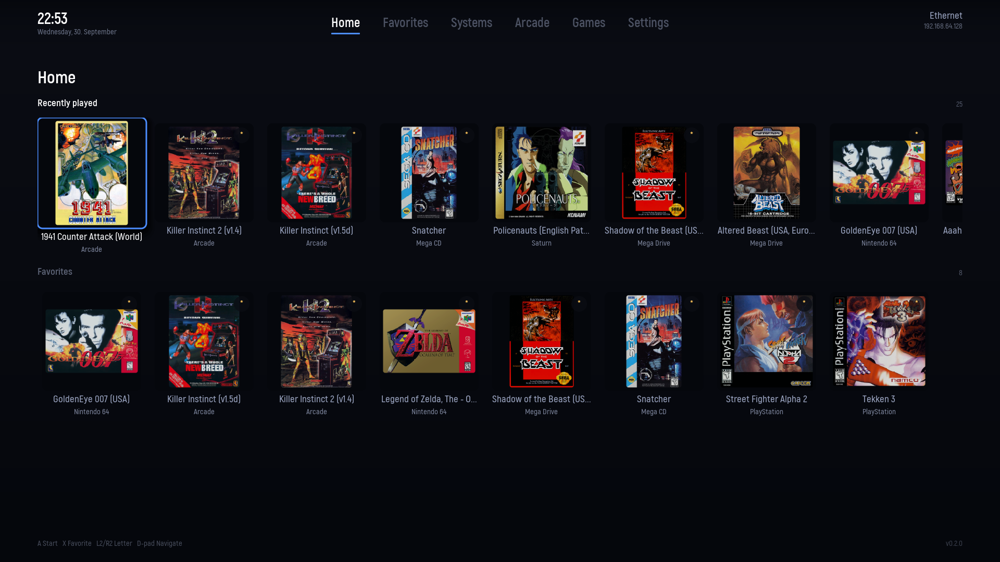
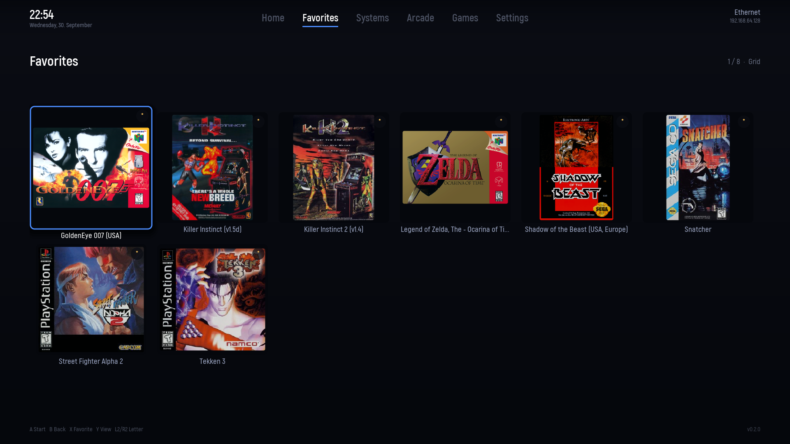
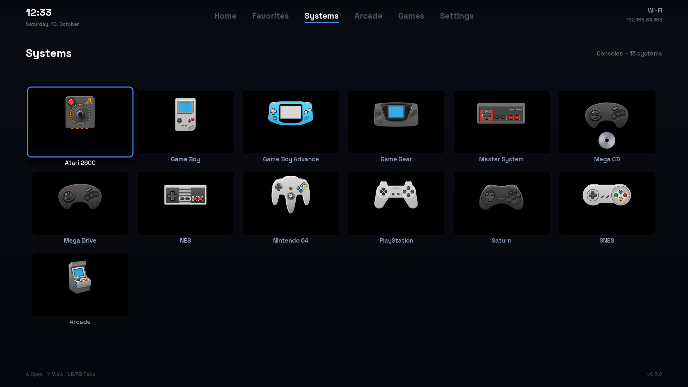
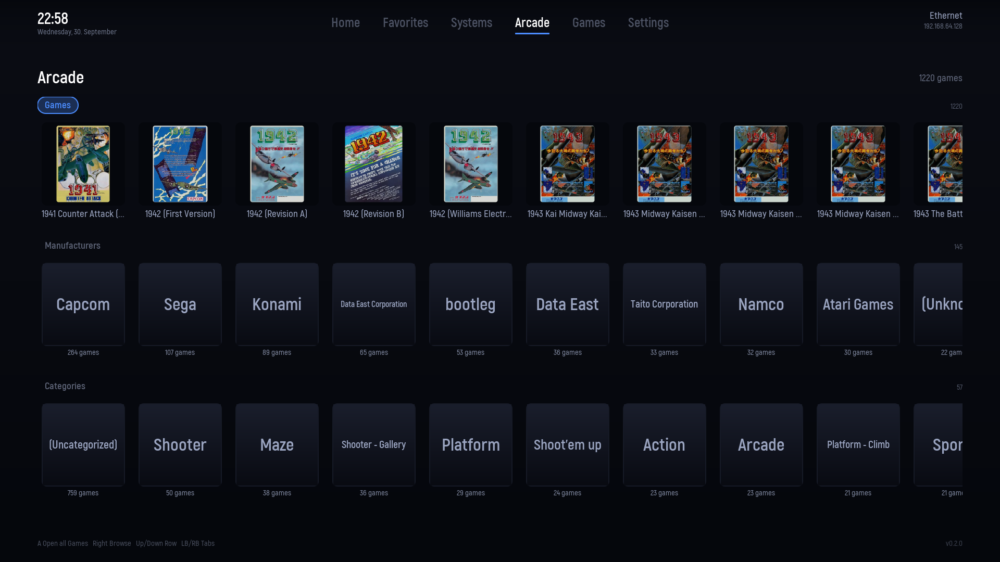
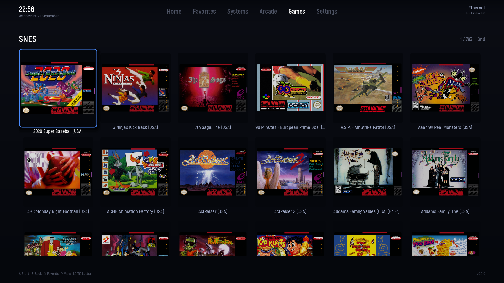
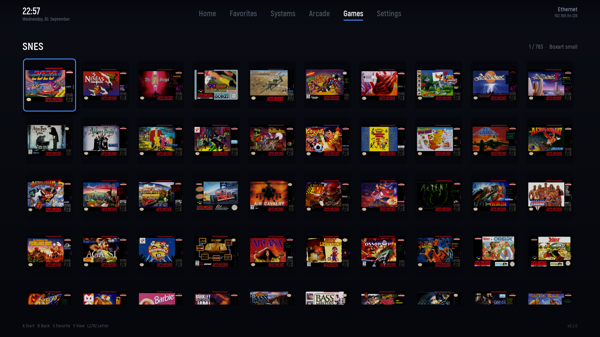
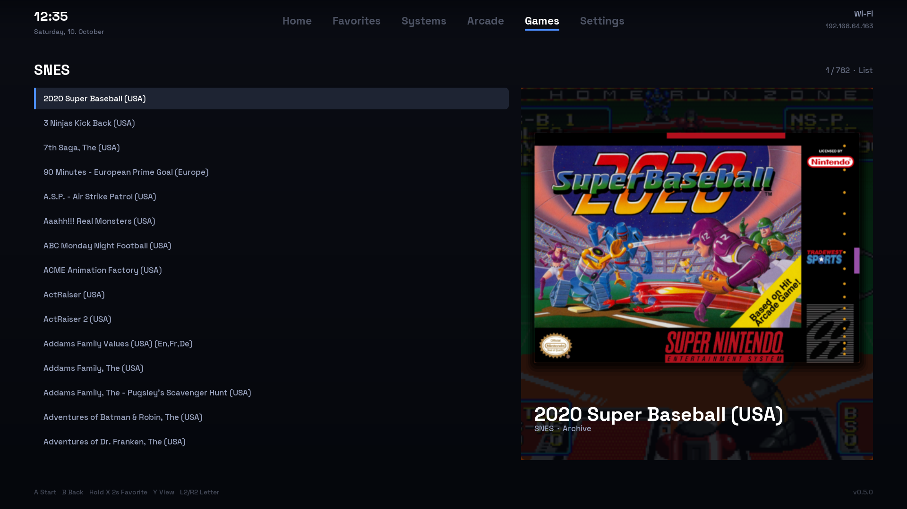
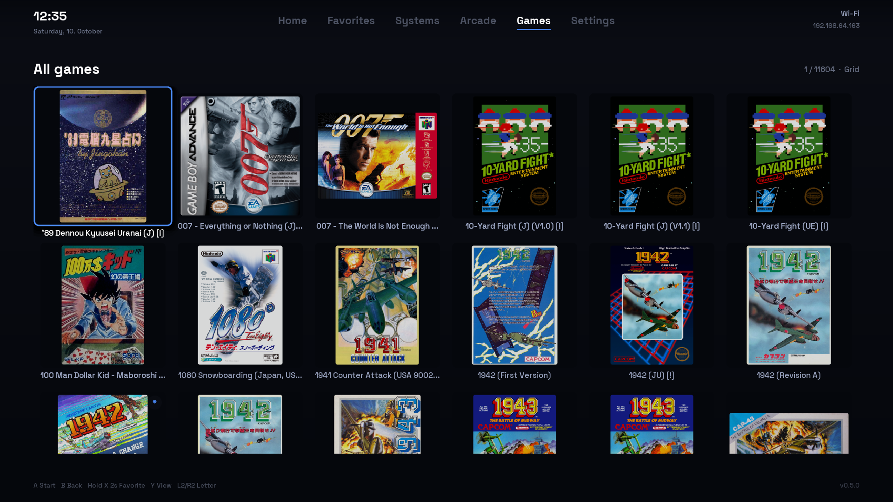
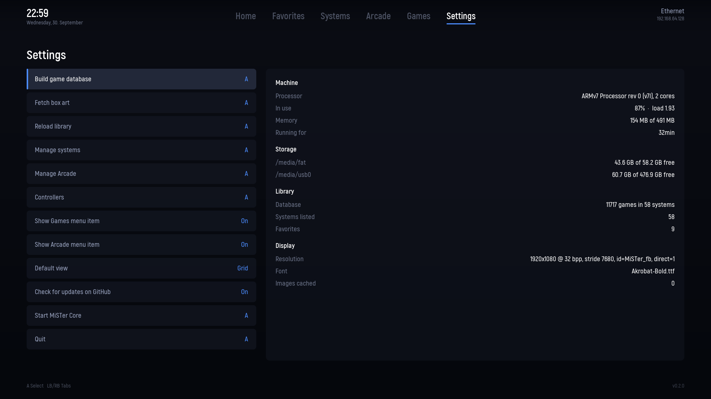
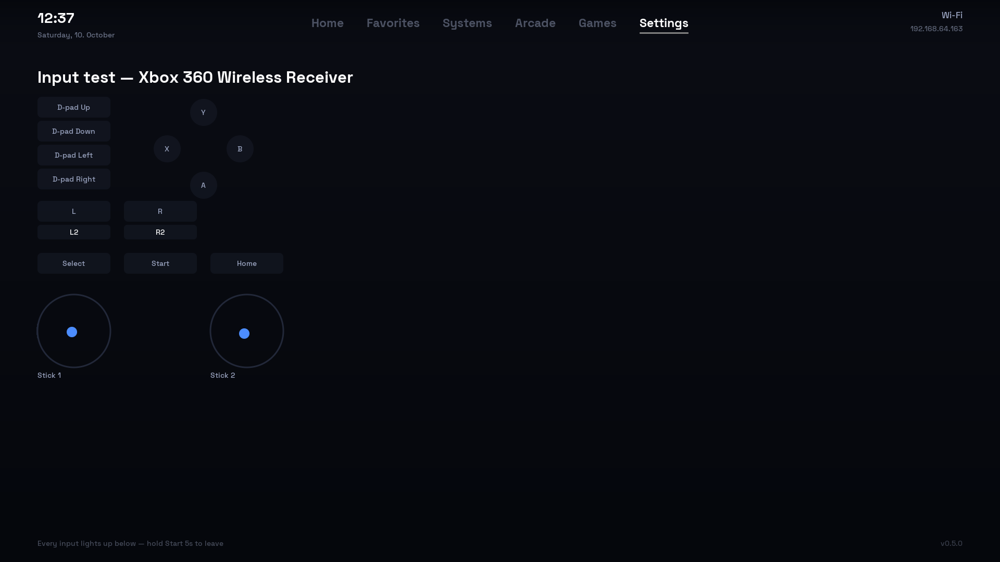

# MiSTer Pat's GUI

A modern game launcher for the [MiSTer FPGA](https://github.com/MiSTer-devel/Main_MiSTer),
written in plain C++ for the device's own Linux side. It boots straight into a 1080p tiled
interface with box art, favourites and history — and hands control back to the MiSTer as soon
as you start a game.

It is not a core. Nothing about the FPGA changes. This is a frontend that picks a game and
asks the MiSTer to load it, the same way the stock menu does.

| Home | Favorites |
| --- | --- |
|  |  |

| Systems | Arcade |
| --- | --- |
|  |  |

Every system's games in the presentation you prefer — Y cycles through them. Here, SNES in
Grid, Boxart small and List:

| Grid | Boxart small |
| --- | --- |
|  |  |

| List | Games |
| --- | --- |
|  |  |

| Settings | Controller input test |
| --- | --- |
|  |  |

## A note on how this was built

This project was built with the help of AI.

I want to be honest about that: without it, this project would not have grown from a proof
of concept into something that actually works — a project genuinely capable of replacing the
official Console Mode. Between the lack of documentation and the fact that Console Mode's own
source is no longer publicly available, reaching this point without that help would have
taken several months, if not years.

At the same time, I want to be just as clear that AI alone would not have gotten here either.
A lot of hard, careful work went into this project — done by a person. Me.

## Why

The MiSTer's stock menu is a file browser. It is fast, precise and does exactly what it was
built to do — but it looks like a file browser, and on a television across a room it reads
like one too.

This project takes the other approach: box art first, a tile grid you can cross with a
D-pad, and the things you actually reach for — recently played, favourites — on the first
screen. It aims to look like a console's own dashboard rather than a directory listing.

The constraint that shapes everything: the DE10-Nano has two Cortex-A9 cores at 800 MHz and
**no GPU**. Every pixel is drawn by the CPU into a framebuffer. That rules out the usual
toolkits and rules in careful, measured software rendering — see
[PERFORMANCE.md](docs/PERFORMANCE.md) for what that costs and where the budget went.

## The premise: easy to use, easy to understand

Every decision in this project is measured against one premise: **easy to use, easy to
understand.** It is drawn on throughout development, and a feature that cannot meet it is
changed until it does, or left out.

In practice that means:

- **No explanation needed.** Someone who picks up the pad for the first time should know what
  a screen does and what the buttons do, without a manual.
- **Order and behaviour can be worked out.** Either an arrangement is logical on its face —
  alphabetical order is the standard example — or it is made visible on screen, for instance by
  showing a count next to each entry. A clever ordering that the user has to guess at fails
  both tests.
- **Reduction first.** When both are possible, prefer the simpler one that needs no extra
  visual explanation. Less on screen, fewer rules to learn.


- **Tile grid** with box art in three presentations per system: list with a large preview,
  grid with titles, and small box art.
- **Games tab** across every system at once, in three rows: recently played, favourites, all
  games.
- **Letter jump** on the shoulder triggers. A single console can hold a few thousand titles;
  L2/R2 skip whole initial letters.
- **Favourites and history**, stored as plain text files you can read and edit.
- **Arcade.** MiSTer's arcade library does not fit "one folder, one core", so it has its own
  treatment: a library of the games that actually work — core installed, ROM zip found,
  every CRC correct, checked the way MiSTer searches for them — an Arcade tab that browses
  it by manufacturer and category, box art matched to the exact ROM revision, and a
  diagnostic table that explains why a game is missing. See [ARCADE.md](docs/ARCADE.md).
- **Its own game database.** A scan works out which systems are installed and what is in
  them, and writes one index file per system. Opening a console reads that one file and
  nothing else.
- **Its own box art preparation**, from Settings — converts existing covers into view-sized
  BMPs and fetches missing art from the libretro thumbnail server. A bounded image worker
  loads covers while the menus remain responsive.
- **Opens instantly, even at 10,000+ games.** A system's list — or the whole library, merged
  and sorted, in the Games tab — fills in progressively rather than blocking on every game's
  artwork before showing anything.
- **Console icons** for systems without art, with a Settings action to download missing BMPs
  and PNG fallback for older installations.
- **Manage systems**, in Settings — hide the systems you do not use from the Systems tab, and
  toggle the Games tab off entirely for a library large enough that browsing it flat stops
  being useful.
- **A default presentation**, in Settings — pick Grid, List or Boxart small once and it
  applies everywhere from then on.
- **A box art switch**, in Settings — hide cover and background artwork while browsing, useful
  for comparing menu responsiveness with image loading out of the way.
- **Multiple game drives**, resolved live rather than assumed — a drive can come back at a
  different `/media/usbN` after a reboot, or a second volume can hold more games, and box art
  and launching both keep working either way.
- **An opt-in check for a newer release**, in Settings — off by default, and the only network
  access here that is not something you asked for in the moment.
- **Starts games through the MiSTer's own loader** — core loading, ROM mounting and the
  in-game OSD all stay in the code that already does them well.
- **Boots straight into the GUI** via a small patch to the MiSTer main binary, which
  also teaches it to recognise a DVI display even when the video mode is pinned in the INI.
- **Scales from 480p to 4K.** Everything is authored against 1080p and scaled.

## Requirements

- A MiSTer (Terasic DE10-Nano) with a working SD card setup
- SSH access to the device
- Your game library on the SD card or one or more USB volumes, wherever the MiSTer finds it
- Console Mode is not required for anything — see the next section
- To build it yourself: macOS or Linux with an `arm-unknown-linux-gnueabihf` cross-toolchain

## Console Mode is not required

This GUI finds your systems and games itself, and fetches its own box art and background
images from the libretro thumbnail server — from Settings, once the database is built.
[Console Mode](https://github.com/Retro-Remake/ConsoleMode_Distribution) by Retro Remake is not
a dependency for any of that:

| What | Where it comes from |
| --- | --- |
| The catalogue of systems | **built by this GUI** |
| The index of games | **built by this GUI** |
| Box art and background images | **prepared and fetched by this GUI** — Settings → *Prepare box art* |
| Fonts | downloaded once by hand — see [INSTALL.md](docs/INSTALL.md#step-0--the-typeface-if-you-want-it) — or the built-in fallback if you skip that |

The typeface, Akrobat, can't be bundled here — Fontfabric's free-font licence allows using it
in your own designs but not redistributing the font files — so getting it stays a one-time
manual step instead of something this GUI fetches for you. Skip it and everything still works;
you get the built-in fallback typeface instead.

Once installed, this GUI takes over the boot path and Console Mode no longer starts. Only its
font files are still read, if present.

## Installation

See **[INSTALL.md](docs/INSTALL.md)** for the full procedure, including how to undo it.

In short: everything the GUI owns lives in one directory on the SD card,
`/media/fat/mister-pat`. Two lines in `MiSTer.ini` point the boot path at it. Nothing else on
the system is modified, and uninstalling means deleting that directory and those two lines.

## Building from source

```sh
# 1. Cross-toolchain (macOS example)
brew tap messense/macos-cross-toolchains
brew install arm-unknown-linux-gnueabihf

# 2. Static dependencies: zlib, libpng, freetype, libjpeg-turbo into third_party/sysroot
third_party/build.sh

# 3. The GUI itself
make                    # produces build/mister-gui

# 4. The patched MiSTer main binary that boots into it
git clone https://github.com/MiSTer-devel/Main_MiSTer third_party/Main_MiSTer
cd third_party/Main_MiSTer
git apply ../../patches/0001-autostart-gui.patch
make
```

The binary is statically linked, so it does not depend on the libraries in the MiSTer root
filesystem. Builds keep DWARF debug information and frame pointers even at `-O2`; the debug
symbols are written to `build/mister-gui.debug` while the deployable binary stays stripped and
small. Linux does not load DWARF sections into memory. Keep the matching `.debug` file from the
build that produced a crash log, since its addresses are needed to resolve the recorded PCs:

```sh
tools/symbolize-crash.sh crash.log
```

Deploy both the GUI and the patched MiSTer launcher, then check without looking at a television:

```sh
tools/deploy.sh                          # stop the GUI, replace both binaries, reboot
tools/screenshot.sh                      # fetch what is on screen as a PNG
make -C tests                            # host-side checks, no device needed
```

## Controls

| Input | Action |
| --- | --- |
| D-pad / stick / arrow keys | Move |
| A / Enter | Open, or start the game |
| B / Escape | Back |
| X / F | Toggle favourite |
| Y / V | Cycle view |
| LB / RB, Page up/down, Tab | Switch tab |
| LT / RT (L2/R2), `,` / `.` | Jump to the previous/next initial letter |
| Menu button, long press | Leave a running game and return to the GUI |
| Q | Quit |

The MiSTer's own OSD stays reachable at all times — the GUI deliberately does not grab input
devices exclusively.

## Tested controllers

| Controller | Connection | Notes |
| --- | --- | --- |
| Xbox Series X pad | 8BitDo Adapter 2 | The daily driver used for most of this project's own development |
| Retro-Bit Sega Saturn pad | 2.4 GHz wireless adapter | D-pad only, no analogue stick. Works great once switched to X-Input mode — see the [pad's manual](https://retro-bit.com/sitepad-data/uploads/2025/07/NA-Saturn-Pro-2.4-GHz-Wireless-Controller_11-16-23.pdf) for the mode switch |
| Xbox 360 pad ×2 | Xbox 360 Wireless Receiver for Windows | Needs a `deadzone=` set to behave — see [CONTROLLER.md](docs/CONTROLLER.md#3-deadzone) — and [INSTALL.md](docs/INSTALL.md) for the vendor/product gotcha that surfaced along the way |
| PS4 controller (DualShock 4) | Wired (USB cable), and Bluetooth | Bluetooth pairing survives a reboot — the pad reconnects on its own, no re-pairing needed |
| 8BitDo Arcade Stick (Xbox version) | 2.4 GHz wireless dongle, and wired (USB cable) | Works flawlessly over both, no extra setup needed |

Still to try: PS5 (DualSense) and the Saturn pad wired. See [CONTROLLER.md](docs/CONTROLLER.md) for
the controller-management feature this is building towards.

## Configuration

| File | Purpose |
| --- | --- |
| `/media/fat/mister-pat/favorites.txt` | Favourites, one per line |
| `/media/fat/mister-pat/history.txt` | Recently played |
| `/media/fat/mister-pat/hidden-systems.txt` | Systems hidden from the Systems tab, one per line — see *Manage systems* in Settings |
| `/media/fat/mister-pat/preferences.txt` | Interface toggles, such as whether the Games and Arcade tabs are shown |
| `/media/fat/mister-pat/systems.conf` | Per-system loader slot overrides, see [the example](assets/systems.conf.example) |
| `/media/fat/mister-pat/icons/` | Console icons |
| `/media/fat/mister-pat/gamesdb/` | The game database: `catalog.tsv`, `roots.tsv` and one `<System>.tsv` per system |
| `/media/fat/mister-pat/logs/crash.log` | Fatal error details, when a crash log could be written |

The GUI also takes command-line options, which is how every screen can be reached and
captured without a controller:

```
--tab home|favorites|systems|arcade|games|settings  screen to open
--view list|grid|small                  game presentation
--system NAME                            preselect a system
--frames N                               render N frames, then exit
--dump PATH                              write the finished canvas to PATH
--press LIST                             feed button presses first, e.g. down,confirm,wait:30
--launch-now                             start the preselected game at once
--dry-run                                print the MGL instead of loading it
--no-wizard                              never open the database wizard
--scan                                   build the game database and exit
--no-input                               do not open the input devices
--exclusive                              grab inputs (blocks the MiSTer OSD)
--stats                                  report where frame time is spent
--full-redraw                            repaint everything every frame
--no-splash                              skip the startup splash
--splash-ms N                            set its initial wait in ms (default 1000)
```

## Repository layout

```
src/              the GUI, one class per file
tests/            host-side checks (damage tracking, letter jump, game database)
tools/            deploy, screenshot and run helpers
docs/             installation, design and performance documentation
assets/           console icons, example configuration
patches/          the patch that makes the MiSTer main binary start this GUI
poc/              the standalone experiments the design was proven with
third_party/      dependency sources; Main_MiSTer is cloned here when building
```

## Documentation

| Document | What it covers |
| --- | --- |
| [INSTALL.md](docs/INSTALL.md) | Installing, verifying and uninstalling |
| [GUI.md](docs/GUI.md) | The interface design: layout, tiles, navigation, typography |
| [PERFORMANCE.md](docs/PERFORMANCE.md) | What was measured, what it cost, and what made it fast |
| [BOXART.md](docs/BOXART.md) | Artwork preparation, formats and scraper matching audit |
| [WIFI.md](docs/WIFI.md) | MiSTer Wi-Fi configuration notes for a later Settings feature |
| [POC.md](docs/POC.md) | How the MiSTer boots, where a frontend hooks in, and what was proven on hardware |
| [CONTROLLER.md](docs/CONTROLLER.md) | Controller-first setup — listing pads, an input test, deadzone, button mapping and Bluetooth pairing: the design, and what real hardware testing found along the way |
| [ARCADE.md](docs/ARCADE.md) | Arcade support — the analysis, the design and what was built from it. The MRA format, a ROM-storage-priority bug found on real hardware, how the library, the tab and the box art work, and what is still open |

## Status

Working: booting into the GUI, browsing every system, box art, favourites, history, letter
navigation, launching games, returning from a game with a long press on the menu button, and
hiding systems or the Games tab from Settings for a large library. Arcade and the built-in
font fallback have been exercised on the MiSTer. The 0.4.0 box-art preparation run over
11,502 entries completed; the user reports that the current interface looks and feels very
good. See [CHANGELOG.md](CHANGELOG.md) and [BOXART.md](docs/BOXART.md).

## Roadmap

**This roadmap is not set in stone.** It is a statement of intent, not a promise: what goes
into which release, and in what order, will move as testing on real hardware shows what matters
most, and a version's scope can shrink, grow or change places with another. Nothing here is
dated. Only the next release is planned with any precision, and even that gets sharper once its
testing has been done — the later ones are direction.

### Release plan

Releases are themed rather than feature-by-feature, so that each one has a single thing it is
for.

#### 0.3.0 — Tests and bug fixes

- [x] **Test the Arcade library, tab, and updated scraper on real hardware.**
- [x] **Improve box art matching** using the real scrape-miss list and an audit of Libretro's
      index. See [BOXART.md](docs/BOXART.md) for results and the limits of the available counts.
- [x] **Font fallback and interface fixes** — test without Akrobat, tune fallback sizing,
      improve spacing, and show Ethernet and Wi-Fi addresses in Settings.
- [x] **Navigation and input fixes** — alphabetize Arcade group previews and require a
      two-second hold to change a favorite.

See [CHANGELOG.md](CHANGELOG.md) for the complete 0.3.0 change list.

#### 0.4.0 — Optimisation

- [x] **Smoother, faster menu control**, everywhere. Confirmed by user testing on the MiSTer.
- [x] **View-sized artwork files and bounded background decoding.** Prepare box art creates
      five BMP sizes with JPEG/PNG fallback; cover decoding runs in a bounded worker queue.
      See [CHANGELOG.md](CHANGELOG.md) for the release details.
- [x] **Optional box art and faster icon startup.** Settings can hide artwork; the one-second
      splash then loads system icons sequentially, preferring native-size BMPs.
- [x] **A much shorter first visit to Systems.** The game database already records which
      systems have games, so the tab can show its grid without building that answer on entry.

#### 0.5.0 — Easy to install ... and to update

- [ ] **A pleasant install flow.** An initial install/update shell script exists in source;
      release publication and end-to-end validation are still needed.
- [ ] **A system, or a process, for updating the GUI.** Today an update means replacing files by
      hand over SSH. There has to be a proper way to get a newer version onto the device.
- [ ] **An extension of `update_all.sh`** (the Update_All_MiSTer script), so installing and
      updating this GUI fits into the way MiSTer users already keep their device current.
- [ ] **Manage Cores / Manage MRAs** for Arcade, syncing against the official distribution
      manifest — the same download-and-verify machinery an installer and updater need. Design
      in [ARCADE.md](docs/ARCADE.md#decision-manage-cores-and-manage-mras).

#### 0.6.0 — Settings, sound and search

- [ ] **More settings**, such as Wi-Fi, and whatever else turns out to be useful to reach from
      the couch. MiSTer-specific Wi-Fi notes are in [WIFI.md](docs/WIFI.md).
- [ ] **A switch for the time format:** 12-hour or 24-hour.
- [ ] **Set the time zone** used for the clock shown in the interface.
- [ ] **Menu sounds.**
- [ ] **Search.** This needs an on-screen keyboard that can be driven entirely from a
      controller, which is the real piece of work in it.

#### Not scheduled yet, but coming

- [ ] **Loader slots for the remaining CD-based cores** (CD-i, Jaguar CD).
- [ ] **Telling two identical controllers apart**, with separate mappings for each (MiSTer's own
      `controller_unique_mapping`). Left out of the first pass of controller management on
      purpose — two same-model pads sharing one mapping is the common case.
- [ ] **Per-game DIP-switch editing** for Arcade.
- [ ] **Video modes.** `video_mode=` in `MiSTer.ini`, including a clean fallback when a
      configured mode fails or is not available. Also covers running, and verifying, this GUI
      at resolutions other than 1080p — it only scales its own design pixels to whatever the
      framebuffer reports, which is untested outside 1080p despite "scales from 480p to 4K"
      being listed as a feature.
- [ ] **Testing more controllers.** See [Tested controllers](#tested-controllers) for what has
      been confirmed so far and what is still to try.
- [ ] **Ordering the systems** in the Systems tab. Hiding the ones you do not use already works.
- [ ] **Telling HDD/CHD-based Arcade games apart** — boards such as Killer Instinct — from those
      that start unattended. Nothing found can automate the one-time manual step itself; see
      [ARCADE.md](docs/ARCADE.md#hddchd-based-games-no-automated-mount-found).
- [ ] **A separately remembered view per tab** — Home, Favorites, Systems and Games — instead
      of the one default view for all of them.
- [ ] **Localisation.** Everything is English today, with the strings still inline; extracting
      them is the prerequisite.

### Ideas, not committed

- [ ] **Group language and revision variants of one game.** Show one entry for titles such as
      Pokémon Sapphire even when the library has separate Europe, Japan and USA ROMs or
      multiple revisions; let the player choose a specific version when needed. Keep the ROMs
      and their language/revision details intact. This is an idea for later, not part of the
      current scraper work.
- [ ] **A web interface for managing the library** from a computer or phone, rather than with
      a game pad: everything under *Library management* above, plus a better search, uploading
      new games to the MiSTer, deleting and renaming them, managing box art, and editing
      favourites.

## Acknowledgements

- [Main_MiSTer](https://github.com/MiSTer-devel/Main_MiSTer) — the MiSTer main binary, which
  this project forks for its boot path and relies on for core loading
- [Console Mode](https://github.com/Retro-Remake/ConsoleMode_Distribution) by Retro Remake —
  whose library cache the GUI currently reads, and whose approach to being gentle with the
  drive it learned from
- [retro-game-console-icons](https://github.com/KyleBing/retro-game-console-icons) — the
  console icon set

## Disclaimer

This is an independent, unofficial hobby project, provided "as is" and without warranty of
any kind, express or implied — including, without limitation, warranties of merchantability,
fitness for a particular purpose, and non-infringement. Use it entirely at your own risk. To
the extent permitted by law, the author accepts no liability for any damage or loss arising
from its use, including but not limited to a corrupted SD card, a bricked device, lost save
data, or any other harm to your hardware or data.

The installer modifies boot-time files on your MiSTer's SD card and replaces the main binary.
Care has been taken to make that reversible — see [INSTALL.md](docs/INSTALL.md) — but as with any
change to a device's boot path, something going wrong is always possible.

This project does not provide, host, link to, or in any way distribute copyrighted game ROMs,
BIOS files, or other game data. It only launches files already present on your own storage,
exactly as the MiSTer's own menu does. You are solely responsible for ensuring you are legally
entitled to any game files you use with it.

This project is not affiliated with, endorsed by, or sponsored by the MiSTer FPGA project,
Terasic, Retro Remake, or any console manufacturer. "MiSTer" and any console, system or
company names referenced or depicted in this project — including in its bundled console icon
set — are the trademarks of their respective owners and are used here only to describe
compatibility, not to claim any association with them.

## License

GPL-3.0. The project builds on Main_MiSTer and bundles the console icon set, both GPL-3.0,
so it is GPL-3.0 throughout. See [LICENSE](LICENSE) for the terms and [NOTICE](NOTICE) for
what came from where.
